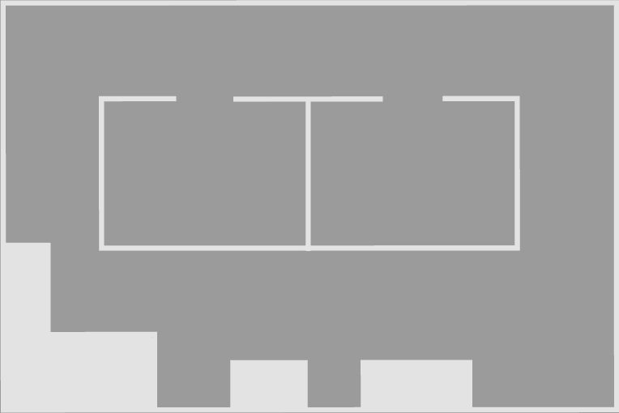
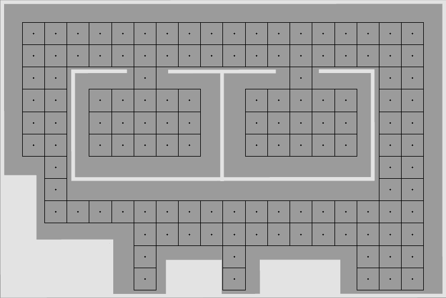
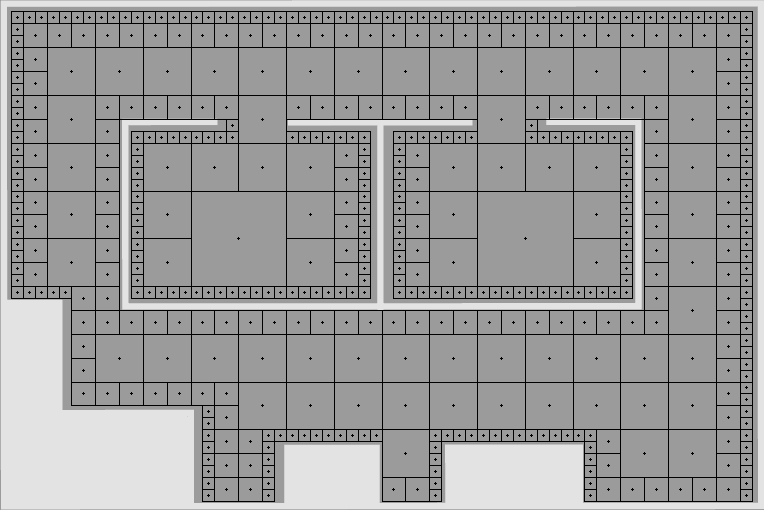

PyQuadTree + RegularNet
-----------------------

This repository is an implementation of a guadtree and a regularnet for creating maps in robotics.

You can set your own map like the one below, and then you can obtain a quadtree or a regularnet which represents the points availables for the robot to operate.

The result of the two methods can be seen below.

